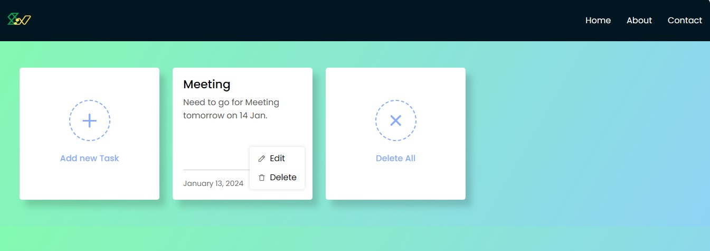

# ToDO_Notes
<p>Simple Notes saving webapp which uses local storage to save and retrieve notes.<br>It also provides edit and delete option.</p>
## Getting Started

1. Clone the repository:

   ```bash
   git clone https://github.com/mohdzain98/ToDO_Notes.git
   cd ToDo_Notes
   
2. Open the web browser and go to <a href="http://localhost/index.html" target="_BLANK">http://localhost/index.html/</a> to view the dashboard
<strong>UI of the notes App</strong>

